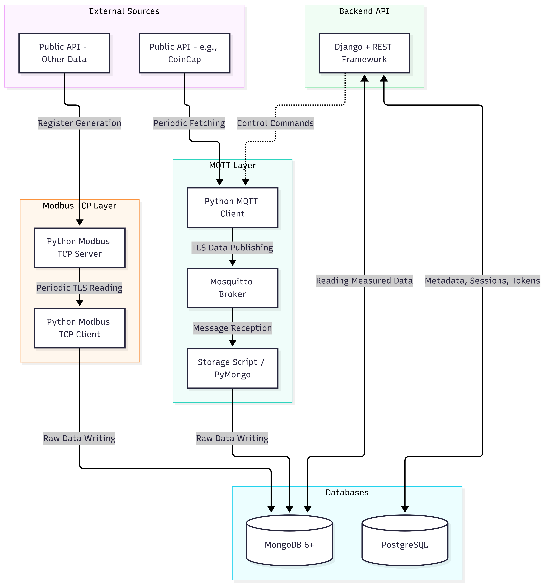

# Sensory telemetry backend

A Django REST API and IoT worker system for collecting, storing, and controlling sensor telemetry through Modbus and MQTT.

## Key Features

- Django 5 and Django REST Framework API.
- Combined telemetry endpoint for the latest Modbus and MQTT readings.
- MQTT control endpoint for starting and stopping active sensor workers by location.
- PostgreSQL storage for sensor metadata and Django application data.
- MongoDB storage for collected Modbus and MQTT telemetry.
- Mosquitto MQTT broker configured for TLS on port `8883`.
- Modbus worker configuration and server/client support.
- Configurable MQTT sensors, including the example Brno and Prague sensors.
- Docker Compose services for PostgreSQL, MongoDB, and Mosquitto.

## Repository Structure

```text
.
├── api/                         # Django application, models, views, tests, and migrations
├── core/                        # Django project settings, URL routing, ASGI, and WSGI
├── docs/                        # Project documentation and architecture assets
├── iot_workers/
│   ├── modbus/                  # Modbus worker, server, client, and configuration
│   └── mqtt/                    # MQTT worker, client, runner, and configuration
├── mosquitto/
│   ├── config/                  # Mosquitto configuration and TLS certificates
│   ├── data/                    # Mosquitto persistent data
│   └── log/                     # Mosquitto logs
├── compose.yml                  # PostgreSQL, MongoDB, and Mosquitto services
├── manage.py                    # Django command-line entry point
├── requirements.txt             # Python dependencies
└── setup_certs.sh               # Certificate setup helper
```

## Installation and Usage

### Prerequisites

- Python 3.12 or another version compatible with the pinned dependencies.
- Docker and Docker Compose.
- OpenSSL, if certificates need to be generated locally.

### 1. Clone the repository

```bash
git clone https://github.com/kika007/Sensor_telemetry_backend
cd Sensor_telemetry_backend
```

### 2. Create and activate a virtual environment

```bash
python3 -m venv .venv
source .venv/bin/activate
python -m pip install --upgrade pip
pip install -r requirements.txt
```

### 3. Start the infrastructure services

```bash
docker compose up --build -d
```

This starts:

- PostgreSQL on `localhost:5432`
- MongoDB on `localhost:27017`
- Mosquitto on `localhost:8883`

To stop the services:

```bash
docker compose down
```

Named Docker volumes preserve database data between restarts. Use `docker compose down -v` only when you intentionally want to remove the stored database volumes.

### 4. Prepare TLS certificates

If the required certificates are not already present, run:

```bash
chmod +x setup_certs.sh
./setup_certs.sh
```

Verify that the certificate paths referenced by the Mosquitto configuration and worker configuration exist under `mosquitto/config/certs/`.

### 5. Apply Django migrations

```bash
python manage.py migrate
```

Create an administrator account when needed:

```bash
python manage.py createsuperuser
```

### 6. Start the Django API

```bash
python manage.py runserver
```

### 7. Start the workers

Run each worker from its own directory so its local imports and configuration paths resolve correctly.

MQTT workers:

```bash
cd iot_workers/mqtt
python run_sensors.py
python mqtt_workers.py
```
Modbus workers

```bash
cd iot_workers/modbus
python modbus_server.py
python modbus_client.py
```

### API Endpoints

| Method | Endpoint | Description |
| --- | --- | --- |
| `GET` | `/api/telemetry/` | Returns the latest Modbus and MQTT telemetry records. |
| `GET` | `/api/control/mqtt/` | Lists active sensor locations available for control. |
| `POST` | `/api/control/mqtt/` | Sends a `start` or `stop` command to selected MQTT sensor workers. |
| `GET` | `/admin/` | Opens the Django administration interface. |

Example MQTT control request:

```bash
curl -X POST http://127.0.0.1:8000/api/control/mqtt/ \
  -H "Content-Type: application/json" \
  -d '{"command":"stop","targets":["brno"]}'
```

Use `"targets":["all"]` to target all active sensors registered in PostgreSQL.

## Project architecture



## Limitations, Known Issues, and Technical Debt

- Credentials and connection details are hardcoded in source files and Compose configuration. Move secrets, database URLs, broker settings, and Django settings to environment variables loaded from a `.env` file or a secrets manager.
- `DEBUG` is enabled and the Django secret key is committed to the repository. Production deployments need secure settings, restricted `ALLOWED_HOSTS`, and rotated secrets.
- The MongoDB database name and some worker/API configuration values are duplicated across files and are not centrally managed.
- The current setup is development-oriented and does not provide a production deployment configuration, process supervisor, health checks, or worker observability.
- MQTT and MongoDB connections are created directly inside request or worker code without an explicit connection lifecycle, pooling strategy, retry policy, or timeout policy.
- API authentication, authorization, throttling, and input validation need to be strengthened before exposing the control endpoint beyond a trusted network.
- Test coverage is limited. More unit, integration, end-to-end, and failure-path tests are needed, especially for MQTT connectivity, MongoDB access, TLS failures, worker startup, and persistence behavior.
- The current tests rely on external service behavior for some successful paths and may require running PostgreSQL, MongoDB, and MQTT infrastructure to provide meaningful coverage.
- Certificate provisioning and rotation are manual. Production deployments should use a documented and automated certificate-management process.
- API schemas, response contracts, and operational runbooks are not yet documented.


